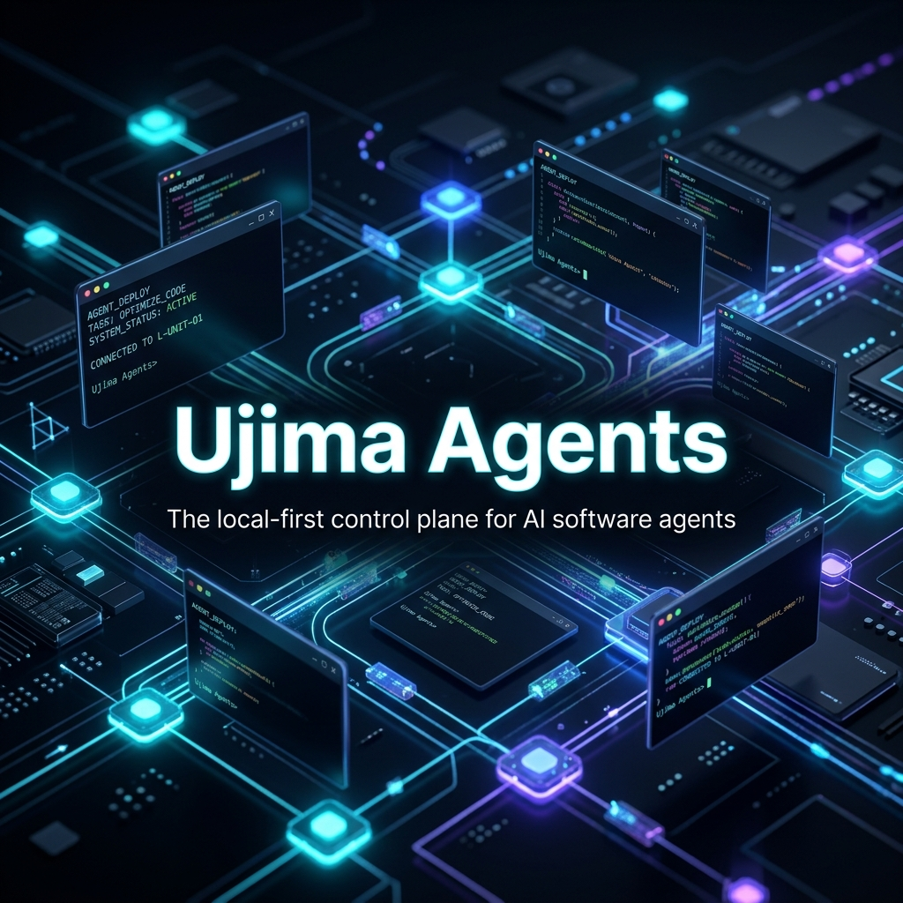
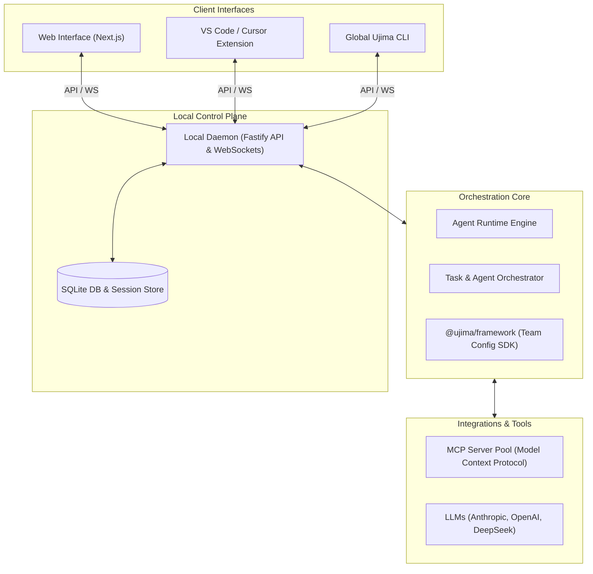

# Ujima Agents



[](https://www.npmjs.com/package/ujima-agents)
[](https://opensource.org/licenses/MIT)
[](http://makeapullrequest.com)

---

## 👥 What if you could run your AI agents as a cohesive team?

A real, persistent team — with distinct names, specialized roles, durable memory, and a shared secure workspace. Agents that message each other, coordinate tasks, wait for your approval on sensitive actions, and stay strictly in scope.

**Ujima** is a local-first control plane for running AI software teams. Set up, collaborate, and co-author with your agents through a beautiful Slack-like Web UI, a deep VS Code/Cursor extension, or a powerful command-line interface — all backed by the same high-performance local runtime.

---

## 🧠 Core Concepts

* **Organization** — Your team has a name, a workspace root folder, and a set of members. Every agent is a persistent, stateful member of that organization.
* **Roles** — Agents are assigned typed roles (`backend-engineer`, `frontend-engineer`, `code-reviewer`, `pm`, etc.) that determine their system instructions, tool access, and workspace subdirectory scope.
* **Channels** — Team communication happens in named channels, threads, DMs, and private self-channels. Agents respond when `@mentioned`; they don't spam every conversation.
* **Task Shell** — Real work can promote into dedicated `task-run` channels where focused worker spirits execute, progress stays visible, and completion/failure summaries link back into the main organization conversation.
* **Approvals** — Sensitive actions (file writes, shell commands, git mutations) are gated behind human approval. Nothing lands in your workspace without your explicit say-so.
* **Workspace Bounds** — All agent execution is hard-sandboxed to your chosen organization root. No traversal, no escape, no surprises.
* **Skills** — Agents can be dynamically equipped with open-source `SKILL.md` capabilities from the community, loaded directly into their operational context.
* **Owner Sessions** — Onboarding creates the first owner credentials and a durable session. Returning to the Web UI restores your signed-in workspace instead of dropping you back into registration-only state.

---

## ⚡ Quick Start: Zero to Running Team

The fastest path to run Ujima is installing our CLI package from **npm**.

### Prerequisites
- **Bun** (version 1.3+) or **Node.js** installed on your machine.
- LLM API keys (e.g., Anthropic, OpenAI, DeepSeek) to power your agents.

### 📦 Path A: Install via npm (Recommended)

#### 1. Install Ujima globally
```bash
npm install -g ujima-agents
# or
bun add -g ujima-agents
```

#### 2. Initialize your workspace
Navigate to your project directory and run the initialization command:
```bash
ujima init --name "Acme Engineering" --owner "Alex" --workspace $(pwd)
```

#### 3. Fire up the team stack
```bash
ujima start
```

---

### 📂 Path B: Local Clone & Setup (For Customizing)

If you'd like to clone the repository to modify or extend the code, follow these steps:

#### 1. Clone & Bootstrap the Stack
```bash
# Clone the repository
git clone https://github.com/ujima-agents/ujima.git
cd ujima

# Install monorepo dependencies
bun install

# Compile the packages
bun run build
```

#### 2. Link the `ujima` Command Line Tool
Register the CLI command globally from the workspace:
```bash
cd packages/cli
bun link
cd ../..
```

#### 3. Initialize & Start
```bash
ujima init --name "Acme Engineering" --owner "Alex" --workspace $(pwd)
ujima start
```
```

> [!TIP]
> Once started, open **[http://localhost:3000](http://localhost:3000)** in your browser to sign in and join your agent team!

---

## 💡 How to Interact with Your Agents

Ujima is built around a multi-surface collaboration model:

| Surface | Best For | Get Started |
| :--- | :--- | :--- |
| **💬 Web Shell (Slack-like UI)** | Realtime brainstorming, multi-agent debates, visual artifact tracking, and channel discussions. | Open `http://localhost:3000` after running `ujima start`. |
| **💻 VS Code & Cursor Extension** | Co-authoring code, inline refactoring, and reviewing agent-driven changes directly in your workspace. | Build and load the extension located under `apps/vscode-extension`. |
| **🛠️ Command Line Interface (CLI)** | Zero-config initial setup, onboarding operations, daemon diagnostics, and quick pipeline triggers. | Run `ujima --help` to explore all available management tools. |

---

## 🏗️ Define Your Team in Code (Infrastructure as Code)

Ujima lets you specify your team configuration declaratively in your repository. Create an `ujima.config.ts` in your workspace root:

```typescript
import { createStarterAgentTeamConfig } from "@ujima/framework";

export const team = createStarterAgentTeamConfig({
  name: "Acme Product Team",
  workspaceRoot: process.cwd(),
  providers: {
    anthropic: { apiKeyRef: "ANTHROPIC_API_KEY" },
    openai: { apiKeyRef: "OPENAI_API_KEY" },
  },
  roles: [
    {
      name: "backend-engineer",
      title: "Backend Engineer",
      description: "Designs robust databases, high-performance APIs, and server logic.",
      workspaceScopes: ["apps/api", "packages/shared"],
      tools: ["read_file", "write_file", "search_grep", "execute_command"],
      instructions: "Follow Clean Architecture guidelines. Write unit tests for all domain logic.",
    },
    {
      name: "code-reviewer",
      title: "Senior QA & Code Reviewer",
      description: "Audits codebase changes, validates test runs, and enforces quality guidelines.",
      workspaceScopes: ["."],
      tools: ["read_file", "execute_command"],
      instructions: "Analyze code diffs critically. Do not accept code that has linting errors.",
    }
  ],
  agents: [
    {
      name: "Alex",
      roleName: "backend-engineer",
      personalityName: "direct",
    },
    {
      name: "Quinn",
      roleName: "code-reviewer",
      personalityName: "skeptical",
    }
  ],
  channels: [
    { name: "general", topic: "Company-wide alignment and high-level announcements." },
    { name: "engineering", topic: "Technical syncs, code reviews, and test pipeline statuses." }
  ],
  policies: {
    requireApprovalForWrites: true,  // No agent can write files without human verification!
    requireApprovalForShell: true,   // CLI execution is locked behind 1-click approvals!
  }
});

export default team;
```

---

## 🛡️ Sandbox & Security Model

Ujima is built from the ground up for **local execution and maximum security**:

* 🔑 **Secrets Stay Local**: All provider LLM keys and API keys reside securely inside your local daemon runtime. The browser interface and extensions never see, store, or transmit your secrets.
* 📦 **Strict Workspace Boundaries**: Every single filesystem, shell, and git action triggered by an agent spirit is dynamically audited and sandboxed to your configured `workspaceRoot`. Directory traversal attacks or unexpected escapes are rejected at the runtime core level.
* 🛑 **Human-in-the-Loop Gatekeeping**: Any operations flagged as high-risk (writing code, installing dependencies, or running shell operations) wait for your direct 1-click confirmation in the Web UI or VS Code sidebar.
* 🗂️ **Fine-Grained Role Scopes**: Restrict specific agents to designated folders (e.g., frontend engineers are restricted to `apps/web`), preventing cross-contamination in monolithic repos.

---

## 🧩 Core Architecture & Codebase Map

Ujima is managed as a high-performance monorepo:



### Folder Structure

| Path | Purpose | Documentation |
| :--- | :--- | :--- |
| [`packages/ujima`](./packages/ujima) | **Framework SDK** — Config creators, personality presets, and role schemas. | [Framework Readme](./packages/ujima/README.md) |
| [`packages/cli`](./packages/cli) | **Command Line Interface** — Entry point for setup, daemon management, and boot operations. | [CLI Readme](./packages/cli/README.md) |
| [`apps/api`](./apps/api) | **Runtime Daemon** — Local orchestrator, realtime event bus, SQLite database, and sandboxed executors. | [API Readme](./apps/api/README.md) |
| [`apps/web`](./apps/web) | **Web Workspace** — React/Next.js interface for messaging, approvals, and real-time trace viewing. | [Web Readme](./apps/web/README.md) |
| [`apps/vscode-extension`](./apps/vscode-extension) | **VS Code Shell** — Sidebars, command panels, and in-editor chat integrations. | [Extension Readme](./apps/vscode-extension/README.md) |

---

## 🛠️ Modifying & Extending Ujima

If you are developing Ujima itself or building custom extensions:

For local browser testing or Codex Run actions, use the combined dev launcher:

```bash
bun run dev:local
```

This builds the API package dependency graph first, then starts the local API on `http://localhost:7511` and the web app on `http://localhost:3452`. The pre-start build keeps runtime packages such as `@ujima/orchestrator` in sync with source changes because the API imports workspace packages from their compiled `dist` entrypoints.

### Running Tests
To run unit and integration tests across the packages:
```bash
bun test
```

### Monorepo Structure guidelines
- **Bun** is the designated package manager. Do not use npm or pnpm commands.
- Shared API contracts under `packages/shared` are load-bearing; modifications require executing `bun run build` to update dependent typing across the workspaces.
- File system validation guards in `packages/shared/src/paths.ts` must never be compromised or skipped.

---

## 📜 License

This project is licensed under the terms of the [MIT License](./LICENSE).
