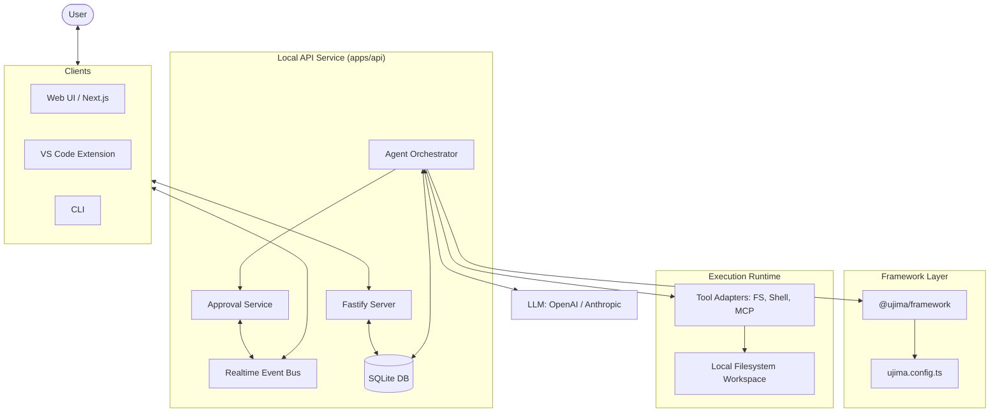

# @ujima/api

Local API daemon for Ujima Agents.

Runs onboarding, org state, channels, approvals, orchestration, and workspace-bounded tool execution. Both product surfaces — the [Slack-like web UI](../web) and the [VS Code extension](../vscode-extension) — use this service as the source of truth.

## System Architecture



## Build

```bash
bun install
bun --cwd apps/api run build
bun --cwd apps/api run typecheck
```

## Entry Points

- `src/main.ts` boots the server and prints startup status.
- `src/server.ts` builds the Fastify app.
- `src/transport/*` handles HTTP and realtime transport.
- `test/*` covers the API runtime behavior.

## Role Catalog Endpoints

- `GET /api/roles/presets` returns every preset role across all industries.
- `GET /api/roles/industries` returns the grouped industry catalog.
- `GET /api/roles/industries/:industry` returns one industry's presets.

## Team Config Sync

The daemon now treats `ujima.config.*` as a first-class source of truth for
config-managed org state.

- Resolution order is `UJIMA_TEAM_CONFIG` -> `ujima.config.ts` -> `ujima.config.js`.
- The daemon reconciles config once at startup and watches the config directory
  for saves to rerun reconcile automatically.
- Reconcile updates config-owned organization fields, agents, channels, and
  providers without deleting user-generated state.
- Removing an agent from config sets `members.retired_at`; removing a channel
  from config sets `channels.archived_at`.
- Archived config-managed channels reject new messages, and retired
  config-managed agents cannot be assigned new runs or task promotions.
- Config-owned fields are tracked with per-field ownership metadata so future
  dashboard edits can reject writes to code-owned settings.

## Owner Auth Flow

The daemon now supports owner credentials and durable DB-backed web sessions in
addition to the existing machine bearer token used by CLI and local service
clients.

- `POST /api/onboarding` now accepts `ownerEmail` and `ownerPassword`, creates
  the first owner auth user, and issues an initial session token alongside the
  org bootstrap payload.
- `POST /api/auth/login` validates owner credentials and issues a new durable
  session token.
- `GET /api/auth/session` resolves the current session state from the
  `x-ujima-session` header and returns authenticated owner/member data when the
  session is valid.
- `POST /api/auth/logout` revokes the current session token.
- `GET /api/bootstrap` now includes an `auth` block so browser clients can make
  one startup call and learn both org readiness and current sign-in state.
- Session tokens are stored as SHA-256 hashes in SQLite. Expired sessions are
  revoked on read, and the browser-facing web app never receives the daemon's
  machine bearer token.

## Messaging Substrate

The org messaging layer now supports persistent channels, DMs, self-channels,
typed mentions, and archive-backed history search.

- Every member gets a private `self` channel at spawn time. `self.note` writes
  there directly and is always allowed, even when broader channel permissions
  are restricted.
- New agent members are auto-added to `#general` and their role channel so they
  appear in the shared org conversation graph immediately.
- Native channel tools (`channel.post`, `channel.reply`, `channel.dm`,
  `channel.list`, `channel.read`) run inside the orchestrator and are policy
  checked through the `channels` pseudo-tool surface. `channel.dm` lazily
  creates a DM on first send and reuses it afterward.
- DMs are private to their participants. Non-members cannot enumerate them,
  read them, or post into them through the channel tool surface.
- `channel.list({ scope: 'all' })` excludes other members' self-channels.
  Self-channels stay private to their owner outside audit/admin access.
- Message posting now records typed `message_mentions` rows and parses
  `@display_name` handles. Mentioned agent members receive `member.alerted`
  realtime events and can wake to reply in the same channel.
- Self-mentions are suppressed so agents do not wake themselves through
  ordinary mention fan-out.
- Message edits and deletes are append-only tombstones via `edited_at` and
  `deleted_at`. Immutable tool-call payloads are preserved even if the prose is
  edited later.
- `general`, `group`, and `task-run` channels default to 90-day retention.
  Expired rows are archived to
  `$UJIMA_HOME/archives/channels/<organization_id>/<channel_id>/<YYYY-MM>.jsonl`,
  and `channel.read(query=...)` still searches archived content through the
  sidecar archive index.

## Task Shell

Task work now lives inside the org messaging surface instead of a separate,
opaque background runner.

- Task sessions create dedicated `task-run` channels and stream turn-batched
  agent activity there, including immutable inline tool-call payloads.
- When the last spirit/worker in a task session finishes, the daemon posts a
  structured completion or failure summary card in the task channel and sends
  link-back summaries to `#general` and the origin channel when applicable.
- Public human messages in `general` and `group` channels can be evaluated by
  the task promoter. High-confidence requests auto-create task sessions;
  medium-confidence requests post a confirmation card; low-confidence chatter is
  skipped. Every promoter decision is audited as `audit.task_promoter`.
- Explicit `/task run [team] <prompt>` messages remain the deterministic
  fallback and create a task session directly without depending on the model
  evaluator.
- Legacy `POST /tasks` also accepts a structured `task_file` payload validated
  by `TaskFileSchema`. That allows clients to submit parsed YAML task files,
  ad hoc agent lists, slim execution mode, and stage sequence hints through the
  existing runtime host without inventing a second checkpoint format.
- `GET /api/runs/:id/detail` now returns task-shell aggregates:
  `activeAgents`, token usage grouped by member, and tool usage grouped by tool
  name, in addition to the base run state, approvals, and channel messages.
- Slim execution mode checkpoints each completed stage under
  `task:<task_id>:slim:checkpoint:<stage>` so a restart can resume from the
  last completed stage instead of re-running the full sequence.

## Workspace Boundary Enforcement

Workspace-root hardening is now enforced at both the REST surface and the
daemon's internal filesystem boundaries.

- Any task, member, channel, run, approval-resume, or organization mutation
  before an organization's workspace root exists returns
  `ERR_NO_WORKSPACE_ROOT` with HTTP `409`.
- Filesystem reads and writes are resolved through a realpath-aware resolver,
  so `..` traversal and symlink escapes are rejected with `ERR_PATH_ESCAPE`
  and HTTP `403` semantics in daemon/tool flows.
- `workspace_members.role_scope_paths` is the runtime allowlist for
  member-scoped filesystem access. Role-scoped members can only touch paths
  inside those subtrees.
- Shell execution is scoped the same way as filesystem access: both `cwd` and
  path-like arguments are normalized through the member's workspace resolver
  before spawn.
- MCP calls also sanitize path-bearing arguments before crossing into external
  tool processes. Org-mode flows use member scope paths; legacy task/runtime
  flows fall back to workspace-root enforcement unless narrower agent scopes
  are available.
- Onboarding and config sync seed `workspace_members` rows for known members,
  and missing rows are lazily backfilled on first scoped-path resolution.

## Dependencies

The API is wired to the merged runtime packages, including `@ujima/agent-runtime`, `@ujima/api-schema`, `@ujima/client-sdk`, `@ujima/context-store`, `@ujima/event-bus`, `@ujima/llm`, `@ujima/mcp-client`, `@ujima/orchestrator`, `@ujima/permissions`, `@ujima/runtime-core`, and `@ujima/shared`.

## Notes

- Keep shell and file operations inside the workspace root.
- Provider secrets stay local.
- Do not move orchestration logic into the web app or extension.
