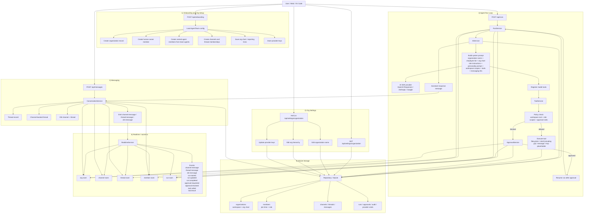

# @ujima/api

Local backend for Ujima.

This service owns:
- team loading and validation
- organization onboarding and settings
- local SQLite persistence
- AI SDK orchestration
- `socket.io` realtime events
- approvals and audit logs
- workspace root enforcement
- tool and MCP policy checks
- agent messaging across threads, channels, and DMs

## Architecture



## Status

The backend is implemented and is the first runnable app in the stack.

## Install

From the monorepo root:

```bash
bun install
```

## Development Notes

- Keep the API local-first.
- Never expose provider secrets to the browser.
- Use the workspace root as a hard boundary for local execution.
- Keep orchestration centered around the AI SDK, Ujima policy layers, and the conversation service.
- Treat shell as the execution path for git commands.
