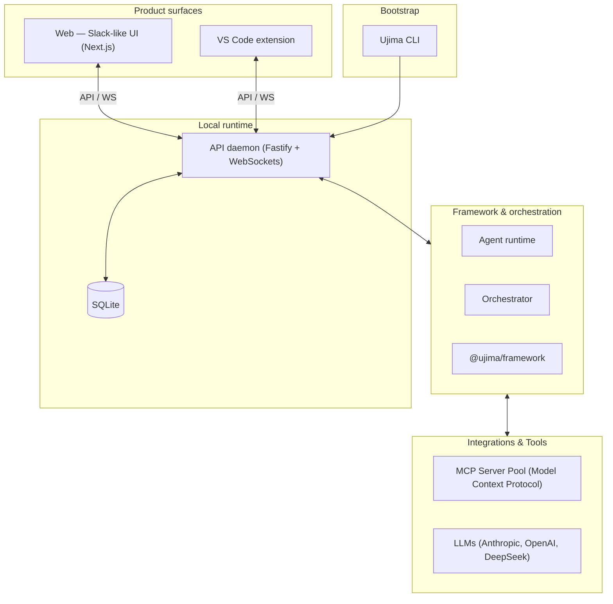

# Ujima Agents


[](https://www.npmjs.com/package/@ujima/agents)
[](https://opensource.org/licenses/MIT)
[](http://makeapullrequest.com)

---

**Ujima Agents** is a framework for building Slack-like teams of AI agents, with roles and workspace-bounded execution.

Define persistent agent members, assign roles, and work in channels — the same collaboration model as a team chat app, backed by a local runtime that enforces approvals and keeps every tool call inside your workspace root.

**Product surfaces**

- **Web** — Slack-like UI for channels, DMs, mentions, approvals, and task runs (`apps/web`)
- **VS Code extension** — the same team in your editor: chat, channels, approvals, and workspace-aware actions (`apps/vscode-extension`)

The CLI bootstraps your org and starts the local stack; both surfaces talk to the same API.

---

## 🧠 Core Concepts

* **Organization** — Your team has a name, a workspace root folder, and a set of members. Every agent is a persistent, stateful member of that organization.
* **Roles** — Agents are assigned typed roles (`backend-engineer`, `frontend-engineer`, `code-reviewer`, `pm`, etc.) that determine their system instructions, tool access, and workspace subdirectory scope.
* **Channels** — Team communication happens in named channels, threads, DMs, and private self-channels. Agents respond when `@mentioned`; they don't spam every conversation.
* **Task runs** — Focused work promotes into dedicated `task-run` channels where workers execute with visible progress; completion and failure summaries link back to the main conversation.
* **Approvals** — Sensitive actions (file writes, shell commands, git mutations) are gated behind human approval. Nothing lands in your workspace without your explicit say-so.
* **Workspace Bounds** — All agent execution is hard-sandboxed to your chosen organization root. No traversal, no escape, no surprises.
* **Skills** — Agents can be dynamically equipped with open-source `SKILL.md` capabilities from the community, loaded directly into their operational context.
* **Owner Sessions** — Onboarding creates the first owner credentials and a durable session. Returning to the Web UI restores your signed-in workspace instead of dropping you back into registration-only state.

---

## ⚡ Quick Start: Zero to Running Team

The fastest path to run Ujima is installing our CLI package from **npm**.

### Prerequisites
- **Bun** (version 1.3+) or **Node.js** installed on your machine.
- LLM API keys (e.g., Anthropic, OpenAI, DeepSeek) to power your agents.

### 📦 Path A: Install via npm (Recommended)

#### 1. Install Ujima globally
```bash
npm install -g @ujima/agents
# or
bun add -g @ujima/agents
```

#### 2. Initialize your workspace
Navigate to your project directory and run the initialization command:
```bash
ujima init --name "Acme Engineering" --owner "Alex" --workspace $(pwd)
```

#### 3. Fire up the team stack
```bash
ujima start
```

---

### 📂 Path B: Local Clone & Setup (coming soon)

**Open source is not public yet.** For now, install from npm (Path A above). The repository will be published when we open-source the project.

When the source is available, you will be able to clone and develop locally:

#### 1. Clone & Bootstrap the Stack
```bash
# Clone the repository
git clone https://github.com/UjimaAgents/ujima-agents.git
cd ujima

# Install monorepo dependencies
bun install

# Compile the packages
bun run build
```

#### 2. Link the `ujima` Command Line Tool
Register the CLI command globally from the workspace:
```bash
cd packages/cli
bun link
cd ../..
```

#### 3. Initialize & Start
```bash
ujima init --name "Acme Engineering" --owner "Alex" --workspace $(pwd)
ujima start
```

> [!TIP]
> Once started, open **[http://localhost:3452](http://localhost:3452)** in your browser to sign in and join your agent team!

---

## Product surfaces

| Surface | What it is | Get started |
| :--- | :--- | :--- |
| **Web** | Slack-like UI for your agent team: channels, threads, DMs, `@mentions`, approvals, and task-run visibility. | Open `http://localhost:3452` after `ujima start`. |
| **VS Code extension** | The same team inside the editor — channels, agent chat, approvals, and workspace-scoped actions on the repo you have open. | Build and load `apps/vscode-extension`. |
| **CLI** | Bootstrap (`ujima init`), start the local API and web app (`ujima start`), and diagnostics. Not a third chat UI — it wires up the runtime both surfaces use. | `ujima --help` |

---

## Define your team in code

The framework is configured declaratively. Create an `ujima.config.ts` in your workspace root:

```typescript
import { createStarterAgentTeamConfig } from "@ujima/framework";

export const team = createStarterAgentTeamConfig({
  name: "Acme Product Team",
  workspaceRoot: process.cwd(),
  providers: {
    anthropic: { apiKeyRef: "ANTHROPIC_API_KEY" },
    openai: { apiKeyRef: "OPENAI_API_KEY" },
  },
  roles: [
    {
      name: "backend-engineer",
      title: "Backend Engineer",
      description: "Designs robust databases, high-performance APIs, and server logic.",
      workspaceScopes: ["apps/api", "packages/shared"],
      tools: ["read_file", "write_file", "search_grep", "execute_command"],
      instructions: "Follow Clean Architecture guidelines. Write unit tests for all domain logic.",
    },
    {
      name: "code-reviewer",
      title: "Senior QA & Code Reviewer",
      description: "Audits codebase changes, validates test runs, and enforces quality guidelines.",
      workspaceScopes: ["."],
      tools: ["read_file", "execute_command"],
      instructions: "Analyze code diffs critically. Do not accept code that has linting errors.",
    }
  ],
  agents: [
    {
      name: "Alex",
      roleName: "backend-engineer",
      personalityName: "direct",
    },
    {
      name: "Quinn",
      roleName: "code-reviewer",
      personalityName: "skeptical",
    }
  ],
  channels: [
    { name: "general", topic: "Company-wide alignment and high-level announcements." },
    { name: "engineering", topic: "Technical syncs, code reviews, and test pipeline statuses." }
  ],
  policies: {
    requireApprovalForWrites: true,  // No agent can write files without human verification!
    requireApprovalForShell: true,   // CLI execution is locked behind 1-click approvals!
  }
});

export default team;
```

---

## 🛡️ Sandbox & Security Model

Ujima is **local-first**: execution and secrets stay on your machine.

* **Secrets stay local** — Provider keys live in the local daemon. The web app and VS Code extension never store or transmit them.
* **Workspace-bounded execution** — Filesystem, shell, and git actions are resolved under your org `workspaceRoot`. Path escapes are rejected at the runtime.
* **Approvals** — Writes, shell commands, and other sensitive operations wait for your confirmation in the web UI or VS Code sidebar.
* **Role scopes** — Restrict agents to subtrees (for example, `apps/web` only) so roles stay separated in monorepos.

---

## 🧩 Core Architecture & Codebase Map

Monorepo layout:



### Folder Structure

| Path | Purpose | Documentation |
| :--- | :--- | :--- |
| [`packages/ujima`](./packages/ujima) | **Framework SDK** — Config creators, personality presets, and role schemas. | [Framework Readme](./packages/ujima/README.md) |
| [`packages/cli`](./packages/cli) | **Command Line Interface** — Entry point for setup, daemon management, and boot operations. | [CLI Readme](./packages/cli/README.md) |
| [`apps/api`](./apps/api) | **Runtime Daemon** — Local orchestrator, realtime event bus, SQLite database, and sandboxed executors. | [API Readme](./apps/api/README.md) |
| [`apps/web`](./apps/web) | **Web** — Slack-like UI for channels, messaging, approvals, and runs. | [Web Readme](./apps/web/README.md) |
| [`apps/vscode-extension`](./apps/vscode-extension) | **VS Code extension** — Editor surface for the same team and API. | [Extension Readme](./apps/vscode-extension/README.md) |

---

## 🛠️ Modifying & Extending Ujima

If you are developing Ujima itself or building custom extensions:

For local development (fixed ports for API + web), use:

```bash
bun run dev:local
```

This builds the API package dependency graph first, then starts the local API on `http://localhost:7511` and the web app on `http://localhost:3452`. The pre-start build keeps runtime packages such as `@ujima/orchestrator` in sync with source changes because the API imports workspace packages from their compiled `dist` entrypoints.

### Running Tests
To run unit and integration tests across the packages:
```bash
bun test
```

### Monorepo Structure guidelines
- **Bun** is the designated package manager. Do not use npm or pnpm commands.
- Shared API contracts under `packages/shared` are load-bearing; modifications require executing `bun run build` to update dependent typing across the workspaces.
- File system validation guards in `packages/shared/src/paths.ts` must never be compromised or skipped.

---

## 📜 License

This project is licensed under the terms of the [MIT License](./LICENSE).
