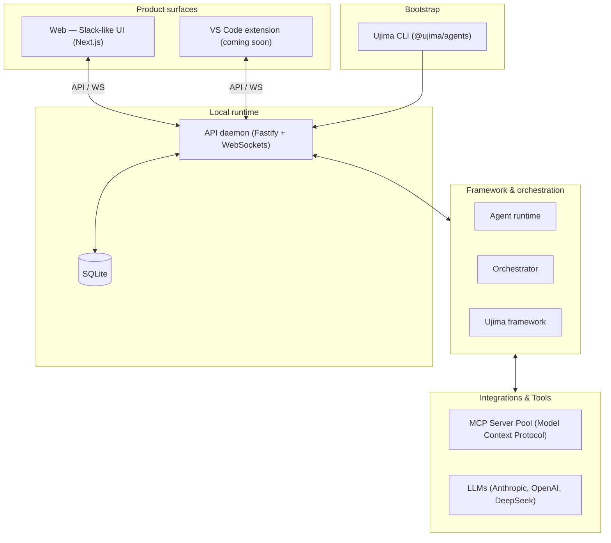

# Ujima Agents


[](https://www.npmjs.com/package/@ujima/agents)
[](https://opensource.org/licenses/MIT)
[](https://github.com/UjimaAgents/ujima-agents)
[](https://x.com/vincent_presh)

> **Ujima Agents is not open source yet.** The runtime ships today via npm; the full monorepo and contributor workflow will be published when we open-source the project.
>
> **Open source — coming soon.** Follow [@vincent_presh on X](https://x.com/vincent_presh) for updates.

---

**Ujima Agents** is a framework for building Slack-like teams of AI agents, with roles and workspace-bounded execution.

Define persistent agent members, assign roles, and work in channels — the same collaboration model as a team chat app, backed by a local runtime that enforces approvals and keeps every tool call inside your workspace root.

**Product surfaces** (via the published npm package)

- **Web** — Slack-like UI for channels, DMs, mentions, approvals, and task runs
- **CLI** — Install from npm, initialize your org, and start the local API + web stack (`ujima init`, `ujima start`)
- **VS Code extension** — Same team in your editor (coming soon as a separate release)

---

## 🧠 Core Concepts

- **Organization** — Your team has a name, a workspace root folder, and a set of members. Every agent is a persistent, stateful member of that organization.
- **Roles** — Agents are assigned typed roles (`backend-engineer`, `frontend-engineer`, `code-reviewer`, `pm`, etc.) that determine their system instructions, tool access, and workspace subdirectory scope.
- **Channels** — Team communication happens in named channels, threads, DMs, and private self-channels. Agents respond when `@mentioned`; they don't spam every conversation.
- **Task runs** — Focused work promotes into dedicated `task-run` channels where workers execute with visible progress; completion and failure summaries link back to the main conversation.
- **Approvals** — Sensitive actions (file writes, shell commands, git mutations) are gated behind human approval. Nothing lands in your workspace without your explicit say-so.
- **Workspace Bounds** — All agent execution is hard-sandboxed to your chosen organization root. No traversal, no escape, no surprises.
- **Skills** — Agents can be equipped with `SKILL.md` capabilities (including community skills) loaded into their operational context.
- **Owner Sessions** — Onboarding creates the first owner credentials and a durable session. Returning to the Web UI restores your signed-in workspace instead of dropping you back into registration-only state.

---

## ⚡ Quick Start (npm)

The supported way to run Ujima today is the **`@ujima/agents`** package on npm.

### Prerequisites

- **Node.js 20+** or **Bun 1.3+**
- LLM API keys (e.g. Anthropic, OpenAI, DeepSeek)

### Install and run

```bash
npm install -g @ujima/agents
# or: bun add -g @ujima/agents

ujima init --name "Acme Engineering" --owner "Alex" --workspace "$(pwd)"
ujima start
```

Open **[http://localhost:3452](http://localhost:3452)** in your browser (default web UI). The API listens on **http://127.0.0.1:7511** by default.

```bash
ujima --help
```

---

## Open source (coming soon)

The **source code is not public yet**. This repository and a full local development setup will be released when we open-source Ujima Agents.

Until then:

- Install and run from **npm** (above) — not from a git clone
- Do not expect public issues, PRs, or contributor docs yet
- Watch [GitHub](https://github.com/UjimaAgents/ujima-agents) and [@vincent_presh on X](https://x.com/vincent_presh) for the open-source announcement

When the project opens, we will publish clone-and-contribute instructions here (monorepo layout, `bun run dev:local`, tests, and package map).

---

## Product surfaces

| Surface               | What it is                                                                                                  | Available today                  |
| :-------------------- | :---------------------------------------------------------------------------------------------------------- | :------------------------------- |
| **Web**               | Slack-like UI for your agent team: channels, threads, DMs, `@mentions`, approvals, and task-run visibility. | Yes — after `ujima start`        |
| **CLI**               | Bootstrap (`ujima init`), start the local API and web app (`ujima start`), and diagnostics.                 | Yes — via `@ujima/agents` on npm |
| **VS Code extension** | The same team inside the editor — channels, agent chat, approvals, and workspace-scoped actions.            | Coming soon                      |

---

## Configure your team

Teams are configured declaratively (e.g. `ujima.config.ts` in your workspace). Example shape:

```typescript
import {createStarterAgentTeamConfig} from "@ujima/framework";

export const team = createStarterAgentTeamConfig({
  name: "Acme Product Team",
  workspaceRoot: process.cwd(),
  providers: {
    anthropic: {apiKeyRef: "ANTHROPIC_API_KEY"},
    openai: {apiKeyRef: "OPENAI_API_KEY"},
  },
  roles: [
    {
      name: "backend-engineer",
      title: "Backend Engineer",
      description:
        "Designs robust databases, high-performance APIs, and server logic.",
      workspaceScopes: ["apps/api", "packages/shared"],
      tools: ["read_file", "write_file", "search_grep", "execute_command"],
      instructions:
        "Follow Clean Architecture guidelines. Write unit tests for all domain logic.",
    },
    {
      name: "code-reviewer",
      title: "Senior QA & Code Reviewer",
      description:
        "Audits codebase changes, validates test runs, and enforces quality guidelines.",
      workspaceScopes: ["."],
      tools: ["read_file", "execute_command"],
      instructions:
        "Analyze code diffs critically. Do not accept code that has linting errors.",
    },
  ],
  agents: [
    {name: "Alex", roleName: "backend-engineer", personalityName: "direct"},
    {name: "Quinn", roleName: "code-reviewer", personalityName: "skeptical"},
  ],
  channels: [
    {
      name: "general",
      topic: "Company-wide alignment and high-level announcements.",
    },
    {
      name: "engineering",
      topic: "Technical syncs, code reviews, and test pipeline statuses.",
    },
  ],
  policies: {
    requireApprovalForWrites: true,
    requireApprovalForShell: true,
  },
});

export default team;
```

---

## 🛡️ Sandbox & Security Model

Ujima is **local-first**: execution and secrets stay on your machine.

- **Secrets stay local** — Provider keys live in the local daemon. The web app and VS Code extension never store or transmit them.
- **Workspace-bounded execution** — Filesystem, shell, and git actions are resolved under your org `workspaceRoot`. Path escapes are rejected at the runtime.
- **Approvals** — Writes, shell commands, and other sensitive operations wait for your confirmation in the web UI or VS Code sidebar.
- **Role scopes** — Restrict agents to subtrees so roles stay separated in monorepos.

---

## Runtime architecture

High-level layout of what `ujima start` runs on your machine:



---

## Contact

Questions or updates: follow [@vincent_presh on X](https://x.com/vincent_presh).

---

## 📜 License

The **`@ujima/agents`** npm distribution is licensed under the [MIT License](./LICENSE). Open-source release of the full repository is **coming soon**; terms for the source tree will be published at that time.
